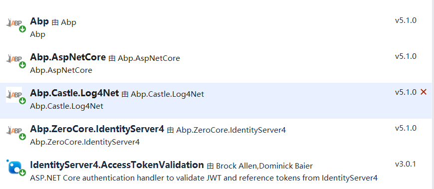
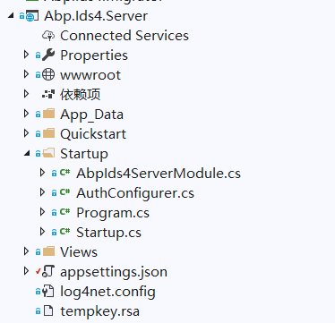

在abp开发的系统后，需要使用这个系统作单点登录，及其他项目登录账号依靠abp开发的系统。在官方文档上只找到作为登录服务[Identity Server Integration](https://aspnetboilerplate.com/Pages/Documents/Zero/Identity-Server)，但是host项目却无法使用登录服务生成的Token获取数据。所有的搜索结果包括abp的issue都是说去看identity server4的文档。我比较笨，文档看了还是不会。好在最后还是试出来了。

---

<div id="toc"></div>

# 创建登录中心项目

1. 到官网下载一个最新的模板项目，项目类型自选(我们项目用的vue，所以我选择的vue项目，.net core3.x)。保证可以运行起来并正常登录。
2. 右键src目录添加一个asp.net core web 空项目，在项目中添加Startup文件夹，把Startup.cs和Program.cs移动到Startup文件夹，并修改这两个文件的命名空间增加Startup。不然会有命名空间和类名冲突。
3. 在nuget添加Abp.ZeroCore.IdentityServer4、Abp、Abp.Castle.Log4Net等引用，添加Web.Core、EntityFrameworkCore项目引用

4. 在Startup文件加新增xxxModule文件，初始化登录中心项目，因为这个项目要用到abp的模块所以要添加module

```c#
using Abp.Ids4;
using Abp.Ids4.Configuration;
using Abp.Modules;
using Abp.Reflection.Extensions;
using Microsoft.AspNetCore.Hosting;
using Microsoft.Extensions.Configuration;

namespace Abp.Ids4.Server.Startup
{
    [DependsOn(
       typeof(Ids4WebCoreModule))]
    public class AbpIds4ServerModule: AbpModule
    {
        private readonly IWebHostEnvironment _env;
        private readonly IConfigurationRoot _appConfiguration;

        public AbpIds4ServerModule(IWebHostEnvironment env)
        {
            _env = env;
            _appConfiguration = env.GetAppConfiguration();
        }

        public override void Initialize()
        {
            IocManager.RegisterAssemblyByConvention(typeof(AbpIds4ServerModule).GetAssembly());
        }
    }
}

```

5. 在Startup文件加新增AuthConfigurer.cs文件，你也可以直接从IdentityServerDemo项目复制文件过来，但是记得修改命名空间

```c#
using System;
using System.Linq;
using System.Text;
using System.Threading.Tasks;
using Abp.Authorization;
using Abp.Ids4;
using Abp.Runtime.Security;
using IdentityServer4.Models;
using Microsoft.AspNetCore.Authentication.JwtBearer;
using Microsoft.AspNetCore.Builder;
using Microsoft.AspNetCore.Hosting;
using Microsoft.Extensions.Configuration;
using Microsoft.Extensions.DependencyInjection;
using Microsoft.IdentityModel.Logging;
using Microsoft.IdentityModel.Tokens;

namespace Abp.Ids4.Server.Startup
{
    public static class AuthConfigurer
    {
        /// <summary>
        /// Configures the specified application.
        /// </summary>
        /// <param name="app">The application.</param>
        /// <param name="configuration">The configuration.</param>
        public static void Configure(IServiceCollection services, IConfiguration configuration)
        {
            var authenticationBuilder = services.AddAuthentication();

            if (bool.Parse(configuration["Authentication:JwtBearer:IsEnabled"]))
            {
                authenticationBuilder.AddJwtBearer(options =>
                {
                    options.TokenValidationParameters = new TokenValidationParameters
                    {
                        // The signing key must match!
                        ValidateIssuerSigningKey = true,
                        IssuerSigningKey = new SymmetricSecurityKey(Encoding.ASCII.GetBytes(configuration["Authentication:JwtBearer:SecurityKey"])),

                        // Validate the JWT Issuer (iss) claim
                        ValidateIssuer = true,
                        ValidIssuer = configuration["Authentication:JwtBearer:Issuer"],

                        // Validate the JWT Audience (aud) claim
                        ValidateAudience = true,
                        ValidAudience = configuration["Authentication:JwtBearer:Audience"],

                        // Validate the token expiry
                        ValidateLifetime = true,

                        // If you want to allow a certain amount of clock drift, set that here
                        ClockSkew = TimeSpan.Zero
                    };

                    options.Events = new JwtBearerEvents
                    {
                        OnMessageReceived = QueryStringTokenResolver
                    };
                });
            }

            IdentityModelEventSource.ShowPII = true;
            authenticationBuilder.AddIdentityServerAuthentication("Bearer", options =>
            {
                options.Authority = configuration["IdentityServer:Authority"];
                options.ApiName = configuration["IdentityServer:ApiName"];
                options.ApiSecret = configuration["IdentityServer:ApiSecret"];
                options.RequireHttpsMetadata = false;
            });
        }

        /* This method is needed to authorize SignalR javascript client.
         * SignalR can not send authorization header. So, we are getting it from query string as an encrypted text. */
        private static Task QueryStringTokenResolver(MessageReceivedContext context)
        {
            if (!context.HttpContext.Request.Path.HasValue ||
                !context.HttpContext.Request.Path.Value.StartsWith("/signalr"))
            {
                //We are just looking for signalr clients
                return Task.CompletedTask;
            }

            var qsAuthToken = context.HttpContext.Request.Query["enc_auth_token"].FirstOrDefault();
            if (qsAuthToken == null)
            {
                //Cookie value does not matches to querystring value
                return Task.CompletedTask;
            }

            //Set auth token from cookie
            context.Token = SimpleStringCipher.Instance.Decrypt(qsAuthToken, AppConsts.DefaultPassPhrase);
            return Task.CompletedTask;
        }
    }
}

```

6. 修改Startup文件,因为有部分文件在Web.Core项目中，但是还没有添加进来，所以现在编译会报错，先忽略

```c#
using System;
using Abp.AspNetCore;
using Abp.AspNetCore.Mvc.Antiforgery;
using Abp.Castle.Logging.Log4Net;
using Abp.Dependency;
using Abp.Ids4.Configuration;
using Abp.Ids4.Identity;
using Abp.Ids4.Web.Core.IdentityServer;
using Abp.Json;
using Castle.Facilities.Logging;
using Microsoft.AspNetCore.Builder;
using Microsoft.AspNetCore.Hosting;
using Microsoft.AspNetCore.Http;
using Microsoft.Extensions.Configuration;
using Microsoft.Extensions.DependencyInjection;
using Microsoft.Extensions.Hosting;
using Newtonsoft.Json.Serialization;

namespace Abp.Ids4.Server.Startup
{
    public class Startup
    {
        private readonly IConfigurationRoot _appConfiguration;

        public Startup(IWebHostEnvironment env)
        {
            _appConfiguration = env.GetAppConfiguration();
        }
        public IServiceProvider ConfigureServices(IServiceCollection services)
        {
            services.AddControllersWithViews(
                   options =>
                   {
                       options.Filters.Add(new AbpAutoValidateAntiforgeryTokenAttribute());
                   }
               ).AddNewtonsoftJson(options =>
               {
                   options.SerializerSettings.ContractResolver = new AbpMvcContractResolver(IocManager.Instance)
                   {
                       NamingStrategy = new CamelCaseNamingStrategy()
                   };
               });

            IdentityRegistrar.Register(services);
            IdentityServerRegistrar.Register(services, _appConfiguration);
            AuthConfigurer.Configure(services, _appConfiguration);

            // Configure Abp and Dependency Injection
            return services.AddAbp<AbpIds4ServerModule>(
                // Configure Log4Net logging
                options => options.IocManager.IocContainer.AddFacility<LoggingFacility>(
                    f => f.UseAbpLog4Net().WithConfig("log4net.config")
                )
            );
        }

        // This method gets called by the runtime. Use this method to configure the HTTP request pipeline.
        public void Configure(IApplicationBuilder app, IWebHostEnvironment env)
        {
            app.UseAbp(); //Initializes ABP framework.
            if (env.IsDevelopment())
            {
                app.UseDeveloperExceptionPage();
            }

            if (bool.Parse(_appConfiguration["IdentityServer:IsEnabled"]))
            {
                app.UseJwtTokenMiddleware();
                app.UseIdentityServer();
            }
            app.UseStaticFiles();
            app.UseRouting();

            app.UseAuthorization();

            app.UseEndpoints(endpoints =>
            {
                endpoints.MapDefaultControllerRoute();
            });
        }
    }
}

```

7. 从Web.Core项目中复制appsettings.json和log4net.config到IdentityServer项目，在appsettings.json文件中增加IdentityServer4配置

```json
{
  "Logging": {
    "LogLevel": {
      "Default": "Information",
      "Microsoft": "Warning",
      "Microsoft.Hosting.Lifetime": "Information"
    }
  },
  "AllowedHosts": "*",

  "ConnectionStrings": {
    "Default": "Server=localhost\\sqlexpress; Database=Ids4Db; Trusted_Connection=True;"
  },

  "Authentication": {
    "Facebook": {
      "IsEnabled": "false",
      "AppId": "",
      "AppSecret": ""
    },
    "Google": {
      "IsEnabled": "false",
      "ClientId": "",
      "ClientSecret": ""
    },
    "JwtBearer": {
      "IsEnabled": "false",
      "SecurityKey": "Ids4_C421AAEE0D126E5C",
      "Issuer": "Ids4",
      "Audience": "Ids4"
    }
  },
  "IdentityServer": {
    "IsEnabled": "true",
    "Authority": "http://localhost:5000",
    "ApiName": "default-api",
    "ApiSecret": "secret",
    "Clients": [
      {
        "ClientId": "client",
        "AllowedGrantTypes": [
          "password",
          "client_credentials"
        ],
        "ClientSecrets": [
          {
            "Value": "def2e777-5d42-4edc-a84a-30136c340e13"
          }
        ],
        "AllowedScopes": [
          "default-api",
          "openid",
          "profile",
          "email"
        ]
      },
      {
        "ClientId": "mvc_implicit",
        "ClientName": "MVC Client",
        "AllowedGrantTypes": [ "implicit" ],
        "RedirectUris": [
          "http://localhost:5002/signin-oidc"
        ],
        "PostLogoutRedirectUris": [
          "http://localhost:5002/signout-callback-oidc"
        ],
        "AllowedScopes": [
          "openid",
          "profile",
          "email",
          "default-api"
        ],
        "AllowAccessTokensViaBrowser": true
      }
    ]
  }
}

```

最终项目结构如下：


# 修改Web.Core项目

从IdentityServerDemo项目复制IdentityServer目录和文件到xxx.Web.Core项目，修改文件中的命名空间和当前项目对应。修改IdentityServerRegistrar文件中的dbcontext，把直接引用dbcontext实例改成引用接口，如下：

```diff
public static void Register(IServiceCollection services, IConfigurationRoot configuration)
{
    services.AddIdentityServer()
        .AddDeveloperSigningCredential()
        .AddInMemoryIdentityResources(IdentityServerConfig.GetIdentityResources())
        .AddInMemoryApiResources(IdentityServerConfig.GetApiResources())
        .AddInMemoryClients(IdentityServerConfig.GetClients(configuration))
--      .AddAbpPersistedGrants<IdentityServerDemoDbContext>()
++      .AddAbpPersistedGrants<IAbpPersistedGrantDbContext>()
        .AddAbpIdentityServer<User>();
}
```

# EntityFrameworkCore项目及其他修改

1. 按照Identity Server Integration文档修改EntityFrameworkCore项目和nuget添加引用，同时把项目因为没有引用包报错的添加引用。现在运行IdentityServer项目从connect/token中获取到token了，但是这个token还不能用。即使按照IdentityServerDemo配置了也用不了，IdentityServerDemo中实际上每个web项目都是登录中心。

2. 修改Web.Host项目的appsettings.json

```json
{
  "ConnectionStrings": {
    "Default": "Server=localhost\\sqlexpress; Database=Ids4Db; Trusted_Connection=True;"
  },
  "App": {
    "ServerRootAddress": "http://localhost:21022/",
    "ClientRootAddress": "http://localhost:8080/",
    "CorsOrigins": "http://localhost:4200,http://localhost:8080,http://localhost:8081,http://localhost:3000"
  },
  "Authentication": {
    "JwtBearer": {
      "IsEnabled": "true",
      "SecurityKey": "Ids4_C421AAEE0D126E5C",
      "Issuer": "Ids4",
      "Audience": "Ids4"
    }
  },
  "IdentityServer": {
    "IsEnabled": "true",
    "Authority": "http://localhost:5000",
    "ApiName": "default-api",
    "ApiSecret": "secret",
    "ClientId": "client",

    // no interactive user, use the clientid/secret for authentication
    "AllowedGrantTypes": "password",

    // secret for authentication
    "ClientSecret": "def2e777-5d42-4edc-a84a-30136c340e13",

    // scopes that client has access to
    "AllowedScopes": "default-api"
  }
}
```

3. Web.Host项目在AuthConfigurer.cs文件的Configure方法中增加如下代码

```c#
var authenticationBuilder = services.AddAuthentication(JwtBearerDefaults.AuthenticationScheme);
IdentityModelEventSource.ShowPII = true;
authenticationBuilder
//    .AddIdentityServerAuthentication(JwtBearerDefaults.AuthenticationScheme, options =>
//{
//    options.Authority = configuration["IdentityServer:Authority"];
//    options.ApiName = configuration["IdentityServer:ApiName"];
//    options.ApiSecret = configuration["IdentityServer:ApiSecret"];
//    //options.Audience = configuration["IdentityServer:ApiName"];
//    options.RequireHttpsMetadata = false;
//})
    .AddJwtBearer(JwtBearerDefaults.AuthenticationScheme, options =>
{
    options.Authority = configuration["IdentityServer:Authority"];
    options.RequireHttpsMetadata = false;
    options.Audience = configuration["IdentityServer:ApiName"];
})
;
```

4. 修改Web.Host项目中的Startup类

```c#
using System;
using System.Linq;
using System.Reflection;
using Microsoft.AspNetCore.Builder;
using Microsoft.AspNetCore.Hosting;
using Microsoft.Extensions.Configuration;
using Microsoft.Extensions.DependencyInjection;
using Microsoft.Extensions.Logging;
using Castle.Facilities.Logging;
using Abp.AspNetCore;
using Abp.AspNetCore.Mvc.Antiforgery;
using Abp.Castle.Logging.Log4Net;
using Abp.Extensions;
using Abp.Ids4.Configuration;
using Abp.Ids4.Identity;
using Abp.AspNetCore.SignalR.Hubs;
using Abp.Dependency;
using Abp.Json;
using Microsoft.OpenApi.Models;
using Newtonsoft.Json.Serialization;
using Abp.Ids4.Web.Core.IdentityServer;

namespace Abp.Ids4.Web.Host.Startup
{
    public class Startup
    {
        private const string _defaultCorsPolicyName = "localhost";

        private readonly IConfigurationRoot _appConfiguration;

        public Startup(IWebHostEnvironment env)
        {
            _appConfiguration = env.GetAppConfiguration();
        }

        public IServiceProvider ConfigureServices(IServiceCollection services)
        {
            //MVC
            services.AddControllersWithViews(
                options =>
                {
                    options.Filters.Add(new AbpAutoValidateAntiforgeryTokenAttribute());
                }
            ).AddNewtonsoftJson(options =>
            {
                options.SerializerSettings.ContractResolver = new AbpMvcContractResolver(IocManager.Instance)
                {
                    NamingStrategy = new CamelCaseNamingStrategy()
                };
            });


            IdentityRegistrar.Register(services);
            AuthConfigurer.Configure(services, _appConfiguration);
            //其他代码
            //...
        }

        public void Configure(IApplicationBuilder app,  ILoggerFactory loggerFactory)
        {
            app.UseAbp(options => { options.UseAbpRequestLocalization = false; }); // Initializes ABP framework.

            app.UseCors(_defaultCorsPolicyName); // Enable CORS!

            app.UseStaticFiles();

            app.UseRouting();

            app.UseAuthentication();
            //app.UseJwtTokenMiddleware();
            if (bool.Parse(_appConfiguration["IdentityServer:IsEnabled"]))
            {
                app.UseJwtTokenMiddleware();
            }

            app.UseAbpRequestLocalization();
            //...其他代码
        }
    }
}

```

1. 修改登录方法从授权中心获取token,修改Web.Core项目TokenAuthController.cs的Authenticate方法

```c#
public async Task<AuthenticateResultModel> Authenticate([FromBody] AuthenticateModel model)
{
    var loginResult = await GetLoginResultAsync(
        model.UserNameOrEmailAddress,
        model.Password,
        GetTenancyNameOrNull()
    );
    if (loginResult.Result != AbpLoginResultType.Success)
    {
        throw new UserFriendlyException("登录失败");
    }
    //var accessToken = CreateAccessToken(CreateJwtClaims(loginResult.Identity));
    var client = new HttpClient();
    var disco = await client.GetDiscoveryDocumentAsync(_appConfiguration["IdentityServer:Authority"]);
    if (disco.IsError)
    {
        throw new UserFriendlyException(disco.Error);
    }
    var tokenResponse = await client.RequestPasswordTokenAsync(new PasswordTokenRequest
    {
        Address = disco.TokenEndpoint,
        ClientId = _appConfiguration["IdentityServer:ClientId"],
        ClientSecret = _appConfiguration["IdentityServer:ClientSecret"],

        UserName = model.UserNameOrEmailAddress,
        Password = model.Password,
        Scope = _appConfiguration["IdentityServer:AllowedScopes"],
    });
    if (tokenResponse.IsError)
    {
        throw new UserFriendlyException(tokenResponse.Error);
    }
    var accessToken = tokenResponse.AccessToken;
    return new AuthenticateResultModel
    {
        AccessToken = accessToken,
        EncryptedAccessToken = GetEncryptedAccessToken(accessToken),
        ExpireInSeconds = (int)_configuration.Expiration.TotalSeconds,
        UserId = loginResult.User.Id
    };
}
```

至此host项目的登录获取的token就是从登录中心获取的了，其他客户端的对接按照[使用Identity Server 4建立Authorization Server](https://www.cnblogs.com/cgzl/p/7780559.html)配置就可以了

---

[原文](https://dashenxian.github.io/post/abp%E9%9B%86%E6%88%90IdentityServer4%E5%92%8C%E5%8D%95%E7%82%B9%E7%99%BB%E5%BD%95.html)

**参考资料**

- [Identity Server Integration](https://aspnetboilerplate.com/Pages/Documents/Zero/Identity-Server)
- [IdentityServerDemo](https://github.com/aspnetboilerplate/aspnetboilerplate-samples/tree/master/IdentityServerDemo)
- [使用Identity Server 4建立Authorization Server](https://www.cnblogs.com/cgzl/p/7780559.html)